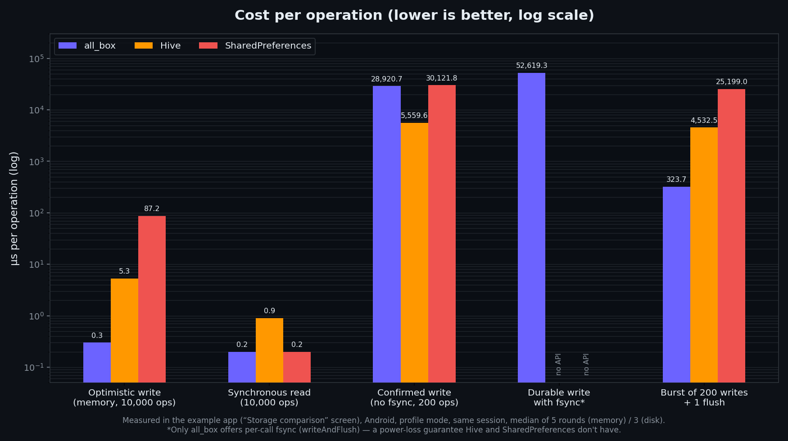

<h1 align="center">all_box</h1>

<p align="center">
🇧🇷 <a href="https://github.com/CriandoGames/all_box/blob/main/README.pt-BR.md">Português</a> | 🇺🇸 English
</p>

<p align="center">
  <a href="https://pub.dev/packages/all_box"></a>
  <a href="https://pub.dev/packages/all_box/score"></a>
  <a href="https://pub.dev/packages/all_box/score"></a>
  <a href="https://github.com/CriandoGames/all_box/blob/main/LICENSE"></a>
  
</p>

<p align="center">
💡 Synchronous, lightweight and fast key-value storage, pure Dart at its core — with crash-safe writes and an optional Flutter reactive layer.
</p>

## Table of contents

- [Features](#-features)
- [Installing](#-installing)
- [Example App](#-example-app)
- [Features in detail](#️-features-in-detail)
- [Usage examples](#-usage-examples)
- [Separating data by user or context](#-separating-data-by-user-or-context)
- [API](#-api)
- [Design decisions](#️-design-decisions)
- [Known limitations](#️-known-limitations-documented-not-hidden)
- [Comparison](#-comparison)
- [When to use it (and when not to)](#-when-to-use-it-and-when-not-to)
- [Testing](#-testing)
- [Documentation](#-documentation)
- [Other packages by us](#-other-packages-by-us)

## 🚀 Features

- 🪶 **100% synchronous reads.** After `init()`, every `read<T>()` is
  synchronous — no `Future`, no `FutureBuilder`, no I/O wait on the read
  path.
- 🧱 **Pure Dart core, Flutter layer optional.** `package:all_box/all_box.dart`
  has no Flutter import at all. `AllBoxListenable` and `AllBoxBuilder` — built
  directly on `ChangeNotifier` and `ValueListenable`, no external
  state-management dependency — live in the separate
  `package:all_box/all_box_flutter.dart` import.
- 🛡️ **Real crash-safety.** Every write lands on a `.tmp` file first, then
  an atomic rename replaces the main file (`.db`); a `.bak` of the last good
  state is kept separately, with automatic two-stage fallback (UTF-8
  decoding errors and `jsonDecode` errors).
- 📍 **Explicit `path`, never resolved internally.** `AllBox` never imports
  `path_provider` nor resolves any directory — whoever calls `init()`
  decides where the container lives. This avoids, by construction, the
  plugin/Activity resolution bugs that affect libraries that resolve the
  path by default.
- ⚡ **Optimistic, debounced writes**, with `writeAndFlush()`/`flushNow()`
  for the moments you need a real, immediate on-disk guarantee.
- 🧪 **In-memory storage for testing.** `AllBox.memory()` runs with no real
  I/O and no real `Timer`, safe for `testWidgets`.
- 🌐 **Web support.** `AllBox.init('settings')` (no `path`) automatically
  uses `window.localStorage` on Web, via `dart:js_interop` — never
  `dart:html` (which blocks `dart2wasm` compilation).

Part of the `all_*` family of open-source packages alongside
[`all_validations_br`](https://pub.dev/packages/all_validations_br)
(Brazilian validations, utilities and encryption) and `all_image_compress`
(image compression).

## 📦 Installing

```
flutter pub add all_box
```

```yaml
dependencies:
  all_box: ^0.3.0
```

Dart-only code (no Flutter widgets) needs just the core:

```dart
import 'package:all_box/all_box.dart';

// Web: no `path` needed — AllBox automatically uses window.localStorage.
final box = await AllBox.init('settings');

// IO (native VM/AOT, incl. Flutter mobile/desktop): pass a directory.
final box = await AllBox.init('settings', path: dir.path);

box.write('name', 'Carlos');
final name = box.read<String>('name');
```

Testing your own app/package against a real `AllBox` instance, with no real
I/O at all:

```dart
final box = await AllBox.memory('settings', initialData: {'darkMode': true});
```

Flutter apps that also want the reactive layer (`AllBoxListenable`,
`AllBoxBuilder`) import the Flutter entrypoint instead — it re-exports
everything from the core, so a single import is enough:

```dart
import 'package:all_box/all_box_flutter.dart';

AllBoxBuilder<String>(
  keyName: 'name',
  builder: (context, value) => Text(value ?? ''),
);
```

## 📱 Example App

The `example/` directory contains an interactive Flutter app (`CounterPage`)
demonstrating the whole day-to-day public surface: optimistic `write()` vs.
`writeAndFlush()`, a reactive `AllBoxBuilder<T>`, `listenAll` for global
side effects (a `SnackBar`), and `flushNow()` fired on
`AppLifecycleState.paused`.

To run it:

```bash
cd example
flutter pub get
flutter run
```

## ⚙️ Features in detail

### Initialization

```dart
import 'package:all_box/all_box.dart';
import 'package:path_provider/path_provider.dart';

Future<void> main() async {
  WidgetsFlutterBinding.ensureInitialized();

  // AllBox never resolves its own directory — you do, after the binding is
  // ready. Any path strategy works. Not needed on Web: `path` is ignored
  // there, since AllBox automatically uses `window.localStorage`.
  final dir = await getApplicationDocumentsDirectory();
  await AllBox.init('my_container', path: dir.path);

  runApp(const MyApp());
}
```

Which storage is used is resolved automatically from the compile target:
Web always uses `window.localStorage`; every other (IO) target uses the
`path` you provide. There's also an advanced `storage:` argument to plug in
your own `AllBoxStorage` implementation, but everyday code never needs it.

### Seeding data on first run (`initialData`)

```dart
await AllBox.init(
  'settings',
  path: dir.path,
  initialData: const {
    'darkMode': false,
    'onboarded': false,
  },
);
```

`initialData` only applies on a genuine first run — when the container
doesn't yet have `<container>.db`/`<container>.bak` on disk. It's persisted
immediately (it doesn't wait for the debounce), so it survives a crash
right after the app's first launch. If the container already existed
before — even as an empty `{}` left by a previous `erase()` — `initialData`
is ignored and whatever is on disk wins.

### Reading and writing (every read is synchronous)

```dart
final box = AllBox('my_container');

box.write('name', 'Carlos');           // optimistic: memory + listeners
                                        // update immediately, disk follows
                                        // ~100ms later (debounced)

String? name = box.read<String>('name');
String safeName = box.readOrDefault<String>('name', 'anonymous');

await box.writeAndFlush('name', 'Carlos'); // waits for disk confirmation

box.remove('name');
box.erase(); // clears everything and notifies every listener that existed

await box.flushNow(); // forces a flush now, e.g. on AppLifecycleState.paused
```

### Listening for changes

```dart
box.listenKey('name', () => print('name changed'));
box.removeListenKey('name', callback);

final dispose = box.listenAll(() => print('container changed'));
// later
dispose();
```

### Reactive widgets, no external state-management dependency

Requires `package:all_box/all_box_flutter.dart` instead of the core-only
`package:all_box/all_box.dart`:

```dart
import 'package:all_box/all_box_flutter.dart';

AllBoxBuilder<int>(
  keyName: 'counter',
  builder: (context, value) => Text('${value ?? 0}'),
)
```

Or build your own `ValueListenable` with `AllBoxListenable<T>`:

```dart
final counter = AllBoxListenable<int>('counter');
ValueListenableBuilder<int?>(
  valueListenable: counter,
  builder: (context, value, _) => Text('${value ?? 0}'),
);
```

### DI-free `.val()` helper (optional)

An opt-in mini state-manager, with no dependency-injection coupling at all:

```dart
final darkMode = 'darkMode'.val(false);
print(darkMode.value);
darkMode.value = true;
```

## 🧪 Usage examples

### Value with a safe fallback

```dart
final box = AllBox('settings');
final theme = box.readOrDefault<String>('theme', 'light');
// Returns 'light' if the 'theme' key doesn't exist yet
```

### Optimistic write vs. confirmed write

```dart
box.write('score', 100);              // memory updated immediately
await box.writeAndFlush('score', 100); // only returns after disk confirms
```

### Reacting to a single key inside a widget

```dart
class DarkModeSwitch extends StatelessWidget {
  const DarkModeSwitch({super.key});

  @override
  Widget build(BuildContext context) {
    return AllBoxBuilder<bool>(
      keyName: 'darkMode',
      builder: (context, value) => Switch(
        value: value ?? false,
        onChanged: (v) => AllBox().write('darkMode', v),
      ),
    );
  }
}
```

### Clearing a container and reacting globally

```dart
final dispose = box.listenAll(() => print('something changed in "settings"'));

box.erase(); // fires the listener above exactly once

dispose();
```

### Container introspection

```dart
box.hasData('theme');   // true / false
box.getKeys();          // every key ever written
box.getValues();        // every value ever written
```

### Persisting app state when paused

```dart
class _MyAppState extends State<MyApp> with WidgetsBindingObserver {
  @override
  void didChangeAppLifecycleState(AppLifecycleState state) {
    if (state == AppLifecycleState.paused) {
      AllBox('my_container').flushNow();
    }
  }
}
```

## 🧩 Separating data by user or context

`all_box` doesn't ship a dedicated "scope", "namespace" or "collection" API
— that's on purpose, to keep the surface small. In real apps you still need
to separate local data by who it belongs to: the logged-in user, an
account, a gym, a company, a session, or just app-wide state. Two patterns
cover this well with the API that already exists.

**A different container per context.** `AllBox.init(container, ...)` takes
an arbitrary container name, and each name is a fully isolated storage —
its own file on IO, its own `localStorage` key on Web:

```dart
final appBox = await AllBox.init('app_settings', path: dir.path);
final userBox = await AllBox.init('user_$userId', path: dir.path);
```

Erasing or clearing one container never touches the other. This fits well
when the number of contexts is small and known ahead of time — e.g. one
container per logged-in user, plus one for app-wide settings.

**Key prefixes inside a single container.** When contexts are more
dynamic, or you'd rather keep everything in one place, prefixing keys works
just as well:

```dart
final userId = 'user_123';

box.write('user:$userId:theme', 'dark');
box.write('user:$userId:profile', profile);

final theme = box.read<String>('user:$userId:theme');
```

```dart
box.write('app:last_logged_user', userId);
box.write('app:language', 'pt-BR');

final language = box.read<String>('app:language');
```

A good practice is to separate keys by context. This helps avoid data
conflicts and makes it easier to remove information from a specific user
without deleting global app settings.

This separation is useful for:

- apps with multiple logged-in users on the same device;
- multi-tenant/SaaS apps (company, gym, organization);
- caching API responses per account;
- local preferences per user profile;
- safely wiping a user's data on logout, without touching global settings;
- keeping temporary session data apart from persistent app state.

For larger projects, consider centralizing key names in a dedicated class
to avoid scattered strings across the app:

```dart
class StorageKeys {
  static String userTheme(String userId) => 'user:$userId:theme';
  static String userProfile(String userId) => 'user:$userId:profile';

  static const appLanguage = 'app:language';
  static const lastLoggedUser = 'app:last_logged_user';
}
```

```dart
box.write(StorageKeys.userTheme(userId), 'dark');

final theme = box.read<String>(
  StorageKeys.userTheme(userId),
);
```

Either pattern keeps `all_box` doing what it's meant for — preferences,
local settings, small app state and micro caches — not a replacement for a
full embedded database with queries, indexes or relations (see
[When to use it](#-when-to-use-it-and-when-not-to)).

## 📚 API

Everything below `AllBoxListenable`/`AllBoxBuilder` is core
(`package:all_box/all_box.dart`); those two live in
`package:all_box/all_box_flutter.dart`.

| Member | Description |
| --- | --- |
| `AllBox([container])` | Factory constructor; returns a singleton per container name. |
| `static AllBox.init(container, {path, flushDelay, initialData, storage})` | Loads `container` into memory and returns the initialized `AllBox`. `path` is required on IO platforms, ignored on Web. `initialData` seeds default values, but only on a genuine first run. `storage` is an advanced override — see below. |
| `static AllBox.memory(container, {initialData})` | Recommended way to test code that consumes `all_box`: no real I/O, no real `Timer`. Replaces the deprecated `initWithMemoryBackendForTesting`. |
| `T? read<T>(key)` / `T readOrDefault<T>(key, fallback)` | Synchronous reads. |
| `void write(key, value)` | Optimistic, debounced write. In debug mode, warns (via a red `debugPrint`) if `value` isn't JSON-encodable, but never throws. |
| `Future<void> writeAndFlush(key, value)` | Writes and waits for disk confirmation. Same serialization warning as `write()`. |
| `void remove(key)` / `void erase()` | Removes a key / clears everything (`erase()` notifies every previously-existing key's listeners). |
| `Future<void> flushNow()` | Forces an immediate flush, bypassing the debounce window. |
| `listenKey(key, cb)` / `removeListenKey(key, cb)` | Per-key listeners. |
| `VoidCallback listenAll(cb)` | Global listener; returns a dispose function. |
| `hasData(key)`, `getKeys()`, `getValues()` | Introspection. |
| `AllBoxListenable<T>` | `ChangeNotifier` + `ValueListenable<T?>` for a single key. |
| `AllBoxBuilder<T>` | Widget that rebuilds when `keyName` changes. |
| `'key'.val<T>(default)` | Optional DI-free mini state-manager handle. |

### Why is `path` required on IO, but not on Web?

`AllBox` **never** imports `path_provider` (nor resolves any directory)
internally. On IO platforms the caller always decides where the container
lives — that's a deliberate design choice, not an oversight (see the
section below). On Web there's nothing to resolve: `window.localStorage` is
always at a fixed, well-known location, so `path` simply doesn't apply
there and is silently ignored if you pass one anyway (handy for code shared
across IO and Web).

## 🛠️ Design decisions

- **Explicit `path` on IO, automatic storage on Web.** `all_box` never
  resolves a directory internally on IO — whoever calls `init()` always
  supplies `path` there, avoiding any plugin resolution inside the library.
  On Web, storage is resolved automatically to `window.localStorage`, since
  there's no meaningful "path" to ask the caller for.
- **`initialData` only applies on a genuine first run.** The check is done
  via the presence of `<container>.db`/`<container>.bak` on disk, not
  in-memory state — a container emptied by `erase()` still has a persisted
  `{}`, so it's not considered a "first run" and the seed isn't reapplied
  over it.
- **Crash-safety via write-ahead + atomic rename.** Every disk write lands
  on a `.tmp` file first, then an atomic rename replaces the main file
  (`.db`); a `.bak` of the last good state is kept separately.
- **Two-stage read error handling.** UTF-8 decoding errors and
  `jsonDecode` errors are treated as distinct failure stages, each falling
  back to `.bak` before giving up and starting empty.
- **Serialized flush queue.** There are never two concurrent writes on the
  same file, even if `flushNow()`/`writeAndFlush()` is called while a
  debounced flush is still in flight.
- **Reproducible benchmark.** Performance numbers measured on-device and
  maintained in this repository — see the [Comparison](#-comparison)
  section; reproduce them yourself with the example app
  (`cd example && flutter run --profile`, then tap the ⚡ icon) or run the
  package's own micro-benchmark with
  `flutter test benchmark/benchmark_test.dart`.
- **A single, generic flush coordinator, shared by every storage.** The
  debounce/coalescing/serialized-flush-queue logic lives once, inside
  `AllBox` itself, and works against any `AllBoxStorage` (disk, Web,
  in-memory, or your own) — it isn't duplicated per backend.
- **Debug-only serialization warning, not an exception.**
  `write()`/`writeAndFlush()` call `jsonEncode` on the value on the spot,
  debug-only, and emit a red `debugPrint` if it isn't serializable — but
  never throw or block the write (same permissive behavior as
  `GetStorage`). The value is still written to memory normally; if it
  truly can't be encoded, the failure only resurfaces silently deep inside
  the flush.
- **Web support via `dart:js_interop`, never `dart:html`.** `dart:html`
  blocks `dart2wasm` compilation, so the Web storage backend is built on
  plain `dart:js_interop` static interop instead (see limitations below for
  what that backend can and can't do).

## ⚠️ Known limitations (documented, not hidden)

- **Web storage (`localStorage`) has real limits.** There's no `fsync`
  equivalent — `save` and `flush` behave identically on Web, since a
  `localStorage.setItem` call is already synchronous. Storage is scoped per
  browser *origin* (scheme + host + port), so `http://localhost:3000` and
  `http://localhost:4000` see completely different storages during local
  development. Size limits vary by browser (commonly a few MB per origin)
  and aren't enforced or reported by `AllBox` ahead of time — a write past
  the limit throws an `AllBoxStorageException`. Data isn't encrypted:
  don't store secrets or sensitive data in a Web container without
  encrypting it yourself first. Not recommended for large volumes of data.
- **Not isolate-safe.** Each `AllBox` keeps its state in memory in the
  isolate where it was initialized; there's no cross-isolate
  synchronization. If you use multiple isolates (e.g. `compute()`,
  background isolates), each one needs its own `init()` and they won't see
  each other's writes until they re-read from disk.
- **`File.rename` for the atomic swap is OS-dependent.** On POSIX
  (Linux/macOS/Android/iOS), renaming over an existing file is atomic. On
  Windows, behavior can vary between Dart SDK versions; test this scenario
  specifically if your app runs on Windows desktop.

## ⚖️ Comparison

| | `all_box` | GetStorage | Hive | Isar | SharedPreferences |
|---|---|---|---|---|---|
| Reads | Synchronous, in memory | Synchronous, in memory | Synchronous (open box) | Synchronous (simple) / async (queries) | Async |
| Storage `path` | Explicit, required | Resolved internally | Resolved by caller | Resolved by caller | Resolved by platform |
| Documented crash-safety | Write-ahead + atomic rename + `.bak` | Not documented at the same level | Internal WAL/compaction | WAL via its own engine | Platform-dependent |
| Web support | Yes (`localStorage`) | Yes | Yes | Yes | Yes |
| Scope | Key-value + reactivity only | Storage + some UI utils (GetX) | Box-oriented storage | Full database | Platform wrapper |



Measured on-device (Android, profile mode) via the example app's "Storage
comparison" screen — median of multiple rounds, same session and same
loops for every lib. The fsync row has a single bar because only `all_box`
offers that guarantee (`writeAndFlush()`).

`all_box` intentionally doesn't try to be a database or resolve its own
`path` — that's a design choice, not a gap.
[Full, detailed comparison, including a performance benchmark, here](documentation/en/comparison.md).

## 🤔 When to use it (and when not to)

Reach for `all_box` when you want simple key-value storage — settings,
flags, small app state — with synchronous reads after boot, optimistic
writes with an explicit opt-in to durable confirmation, and a reactive
layer with no external state-management dependency.

Reach for something else when you specifically need what it specializes
in: Web support and custom type adapters (Hive), a full embedded database
with queries/indexes/relations (Isar), or the Flutter ecosystem's most
"standard" platform wrapper (SharedPreferences) for a small app that
doesn't need built-in reactivity.

## 🧪 Testing

```bash
flutter test
```

The tests specifically cover the bug scenarios mapped above: a file
corrupted with random binary bytes, invalid JSON, fallback to `.bak`,
multiple `write()` calls coalescing into a single flush, isolation between
containers, correct listener notification on `erase()`, and
`listenKey`/`listenAll` being correctly removed.

### Testing code that consumes `all_box`

If you're testing your own app/package (not `all_box` itself), you don't
need a real directory on disk (or a browser) — use in-memory storage:

```dart
final box = await AllBox.memory(
  'my_container',
  initialData: {'darkMode': true},
);
```

This does no real I/O and schedules no real `Timer` (every `write()`
"flushes" synchronously) — this matters especially inside `testWidgets`:
your `FakeAsync` zone expects every `Timer` to resolve before the test
ends, and a real disk/Web-backed container would leave a debounce `Timer`
pending there.

(The older `AllBox.initWithMemoryBackendForTesting()` still works — it's
now a thin, `@Deprecated` wrapper around `AllBox.memory()`.)

## 📚 Documentation

- [Comparison](documentation/en/comparison.md) — detailed comparison vs. GetStorage, Hive, Isar, SharedPreferences, including a performance benchmark.

## 📦 Other packages by us

`all_box` is part of a small family of zero/low-dependency Dart & Flutter
packages published under the
[`opensource.tatamemaster.com.br`](https://pub.dev/publishers/opensource.tatamemaster.com.br/packages)
verified publisher:

| Package | Version | Description |
|---|---|---|
| [`all_observer`](https://pub.dev/packages/all_observer) | [](https://pub.dev/packages/all_observer) | Reactive state for Flutter with zero dependencies — `final count = 0.obs;` + `Observer(...)`. |
| [`all_validations_br`](https://pub.dev/packages/all_validations_br) | [](https://pub.dev/packages/all_validations_br) | Brazilian document validation (CPF, CNPJ, CNH, PIX), input formatters/masks, JWT/UUID/currency/encryption utilities. |
| [`all_image_compress`](https://pub.dev/packages/all_image_compress) | [](https://pub.dev/packages/all_image_compress) | Pure-Dart image compression (JPEG, PNG, GIF, BMP, TIFF, WebP), running in isolates. |

## 👥 Contributors

[](https://github.com/CriandoGames/all_box/graphs/contributors)

Made with [contrib.rocks](https://contrib.rocks).

Contributions are welcome! Read [CONTRIBUTING.md](CONTRIBUTING.md) to get
started.

---

Issues and pull requests are welcome at the
[GitHub repository](https://github.com/CriandoGames/all_box). Distributed under the [MIT](LICENSE) license.
