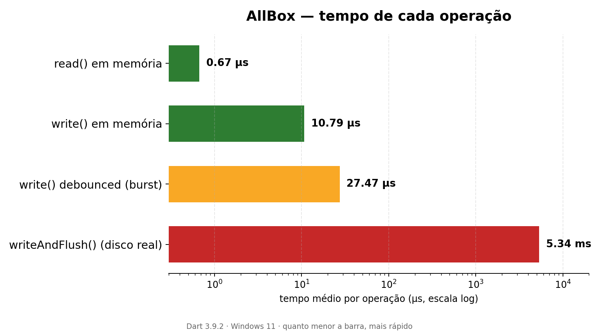

<h1 align="center">all_box</h1>

<p align="center">
🇺🇸 <a href="https://github.com/CriandoGames/all_box/blob/main/README.md">English</a> | 🇧🇷 Português
</p>

<p align="center">
  <a href="https://pub.dev/packages/all_box"></a>
  <a href="https://pub.dev/packages/all_box/score"></a>
  <a href="https://pub.dev/packages/all_box/score"></a>
  <a href="https://github.com/CriandoGames/all_box/blob/main/LICENSE"></a>
  
</p>


<p align="center">
💡 Armazenamento chave-valor síncrono, leve e rápido para Flutter — com escrita crash-safe e camada reativa 100% Flutter.
</p>

## Sumário

- [Features](#-features)
- [Instalação](#-instalação)
- [App de Exemplo](#-app-de-exemplo)
- [Funcionalidades](#️-funcionalidades)
- [Exemplos de Uso](#-exemplos-de-uso)
- [API](#-api)
- [Decisões de Design](#️-decisões-de-design)
- [Limitações conhecidas](#️-limitações-conhecidas-documentadas-não-escondidas)
- [Benchmark próprio](#-resultado-do-benchmark-execução-local)
- [Comparação](#-comparação)
- [Quando usar (e quando não usar)](#-quando-usar-e-quando-não-usar)
- [Testes](#-testes)
- [Documentação](#-documentação)
- [Outros pacotes nossos](#-outros-pacotes-nossos)

## 🚀 Features

- 🪶 **Leituras 100% síncronas.** Depois do `init()`, todo `read<T>()` é síncrono — sem `Future`, sem `FutureBuilder`, sem espera de I/O no caminho de leitura.
- 🔌 **Camada reativa 100% Flutter.** `AllBoxListenable` e `AllBoxBuilder` são construídos diretamente sobre `ChangeNotifier` e `ValueListenable` — sem nenhuma dependência externa de gerenciamento de estado.
- 🛡️ **Crash-safety de verdade.** Toda escrita passa por um arquivo `.tmp` e só então um rename atômico substitui o arquivo principal (`.db`); um `.bak` do último estado bom é mantido à parte, com fallback automático em dois estágios (erro de decodificação UTF-8 e erro de `jsonDecode`).
- 📍 **`path` explícito, nunca resolvido internamente.** `AllBox` nunca importa `path_provider` nem resolve diretório algum — quem chama `init()` decide onde o container vive. Isso evita, por construção, os bugs de resolução de plugin/Activity que afetam bibliotecas que resolvem o path por padrão.
- ⚡ **Escrita otimista + debounced**, com `writeAndFlush()`/`flushNow()` para os momentos em que você precisa de uma confirmação real e imediata em disco.
- 🧪 **Backend em memória para testes.** `AllBox.initWithMemoryBackendForTesting()` roda sem I/O real e sem `Timer` real, seguro para `testWidgets`.


## 📦 Instalação

```
flutter pub add all_box
```

```yaml
dependencies:
  all_box: ^0.2.1
```

```dart
import 'package:all_box/all_box.dart';
```

## 📱 App de Exemplo

O diretório `example/` contém um app Flutter interativo (`CounterPage`) que
demonstra toda a superfície pública usada no dia a dia: `write()` otimista
vs. `writeAndFlush()`, `AllBoxBuilder<T>` reativo, `listenAll` para efeitos
colaterais globais (um `SnackBar`) e `flushNow()` disparado em
`AppLifecycleState.paused`.

Para rodar:

```bash
cd example
flutter pub get
flutter run
```

## ⚙️ Funcionalidades

### Inicialização

```dart
import 'package:all_box/all_box.dart';
import 'package:path_provider/path_provider.dart';

Future<void> main() async {
  WidgetsFlutterBinding.ensureInitialized();

  // AllBox nunca resolve o próprio diretório — quem resolve é você, depois
  // que o binding estiver pronto. Qualquer estratégia de path funciona.
  final dir = await getApplicationDocumentsDirectory();
  await AllBox.init('my_container', path: dir.path);

  runApp(const MyApp());
}
```

### Seed de dados no primeiro run (`initialData`)

```dart
await AllBox.init(
  'settings',
  path: dir.path,
  initialData: const {
    'darkMode': false,
    'onboarded': false,
  },
);
```

`initialData` só é aplicado em um first-run de verdade — quando o container
ainda não tem `<container>.db`/`<container>.bak` no disco. É persistido
imediatamente (não espera o debounce), então sobrevive a um crash logo após
o primeiro lançamento do app. Se o container já existia antes — mesmo que
como um `{}` vazio deixado por um `erase()` anterior — `initialData` é
ignorado e o que está em disco prevalece.

### Leitura e escrita (toda leitura é síncrona)

```dart
final box = AllBox('my_container');

box.write('name', 'Carlos');           // otimista: memória + listeners
                                        // atualizam na hora, o disco segue
                                        // ~100ms depois (debounced)

String? name = box.read<String>('name');
String safeName = box.readOrDefault<String>('name', 'anonymous');

await box.writeAndFlush('name', 'Carlos'); // espera o disco confirmar

box.remove('name');
box.erase(); // limpa tudo e notifica todos os listeners que existiam

await box.flushNow(); // força um flush agora, ex.: em AppLifecycleState.paused
```

### Escutando mudanças

```dart
box.listenKey('name', () => print('name mudou'));
box.removeListenKey('name', callback);

final dispose = box.listenAll(() => print('container mudou'));
// depois
dispose();
```

### Widgets reativos, sem dependências externas de gerenciamento de estado

```dart
AllBoxBuilder<int>(
  keyName: 'counter',
  builder: (context, value) => Text('${value ?? 0}'),
)
```

Ou construa seu próprio `ValueListenable` com `AllBoxListenable<T>`:

```dart
final counter = AllBoxListenable<int>('counter');
ValueListenableBuilder<int?>(
  valueListenable: counter,
  builder: (context, value, _) => Text('${value ?? 0}'),
);
```

### Helper `.val()` sem DI (opcional)

Um mini state-manager opt-in, sem qualquer acoplamento de injeção de
dependência:

```dart
final darkMode = 'darkMode'.val(false);
print(darkMode.value);
darkMode.value = true;
```

## 🧪 Exemplos de Uso

### Valor com fallback seguro

```dart
final box = AllBox('settings');
final theme = box.readOrDefault<String>('theme', 'light');
// Retorna 'light' se a chave 'theme' ainda não existir
```

### Escrita otimista vs. escrita confirmada

```dart
box.write('score', 100);              // memória atualizada na hora
await box.writeAndFlush('score', 100); // só retorna após confirmar no disco
```

### Reagindo a uma única chave dentro de um widget

```dart
class DarkModeSwitch extends StatelessWidget {
  const DarkModeSwitch({super.key});

  @override
  Widget build(BuildContext context) {
    return AllBoxBuilder<bool>(
      keyName: 'darkMode',
      builder: (context, value) => Switch(
        value: value ?? false,
        onChanged: (v) => AllBox().write('darkMode', v),
      ),
    );
  }
}
```

### Limpando um container e reagindo globalmente

```dart
final dispose = box.listenAll(() => print('algo mudou em "settings"'));

box.erase(); // dispara o listener acima uma única vez

dispose();
```

### Introspecção do container

```dart
box.hasData('theme');   // true / false
box.getKeys();          // todas as chaves gravadas
box.getValues();        // todos os valores gravados
```

### Persistindo o estado do app ao ser pausado

```dart
class _MyAppState extends State<MyApp> with WidgetsBindingObserver {
  @override
  void didChangeAppLifecycleState(AppLifecycleState state) {
    if (state == AppLifecycleState.paused) {
      AllBox('my_container').flushNow();
    }
  }
}
```

## 📚 API

| Member | Descrição |
| --- | --- |
| `AllBox([container])` | Factory constructor; retorna um singleton por nome de container. |
| `static AllBox.init(container, {required path, flushDelay, initialData})` | Carrega o `container` do disco para a memória. `path` é obrigatório — veja abaixo. `initialData` semeia valores default, mas só num first-run de verdade. |
| `T? read<T>(key)` / `T readOrDefault<T>(key, fallback)` | Leituras síncronas. |
| `void write(key, value)` | Escrita otimista + debounced. Em debug, avisa (via `debugPrint` em vermelho) se `value` não for JSON-encodável, mas nunca lança exceção. |
| `Future<void> writeAndFlush(key, value)` | Escreve e espera a confirmação em disco. Mesmo aviso de serialização de `write()`. |
| `void remove(key)` / `void erase()` | Remove uma chave / limpa tudo (`erase()` notifica os listeners de todas as chaves que existiam). |
| `Future<void> flushNow()` | Força um flush imediato, ignorando a janela de debounce. |
| `listenKey(key, cb)` / `removeListenKey(key, cb)` | Listeners por chave. |
| `VoidCallback listenAll(cb)` | Listener global; retorna uma função de dispose. |
| `hasData(key)`, `getKeys()`, `getValues()` | Introspecção. |
| `AllBoxListenable<T>` | `ChangeNotifier` + `ValueListenable<T?>` para uma chave. |
| `AllBoxBuilder<T>` | Widget que reconstrói quando `keyName` muda. |
| `'key'.val<T>(default)` | Handle opcional de mini state-manager sem DI. |

### Por que `path` é um parâmetro obrigatório de `init()`?

`AllBox` **nunca** importa `path_provider` (nem resolve diretório algum)
internamente. Quem chama sempre decide onde o container vive. É uma escolha
de design deliberada, não um descuido — veja a seção abaixo.

## 🛠️ Decisões de Design

- **`path` explícito e obrigatório em `init()`.** O `all_box` nunca resolve
  diretório algum internamente — quem chama `init()` sempre informa o
  `path`, evitando qualquer resolução de plugin dentro da lib.
- **`initialData` só se aplica em first-run de verdade.** A checagem é feita
  pela existência de `<container>.db`/`<container>.bak` em disco, não pelo
  conteúdo em memória — um container esvaziado por `erase()` ainda tem um
  `{}` persistido, então não é considerado "primeiro run" e o seed não é
  reaplicado por cima dele.
- **Crash-safety com write-ahead + rename atômico.** Toda escrita em disco
  passa por um arquivo `.tmp` e só então um rename atômico substitui o
  arquivo principal (`.db`); um `.bak` do último estado bom é mantido à
  parte.
- **Tratamento de leitura em dois estágios.** Erros de decodificação UTF-8 e
  erros de `jsonDecode` são tratados como estágios/pontos de falha
  distintos, cada um com fallback para o `.bak` antes de desistir e começar
  vazio.
- **Fila de flush serializada.** Nunca há duas escritas concorrentes no
  mesmo arquivo, mesmo se `flushNow()`/`writeAndFlush()` for chamado com um
  flush debounced ainda em andamento.
- **Benchmark próprio.** Números de performance medidos e mantidos neste
  repositório; veja `benchmark/` e a seção [Comparação](#-comparação).
- **Aviso de serialização em debug, não exceção.** `write()`/`writeAndFlush()`
  chamam `jsonEncode` no valor na hora, só em debug, e emitem um
  `debugPrint` em vermelho se ele não for serializável — mas nunca lançam
  exceção nem bloqueiam a escrita (mesmo comportamento permissivo do
  `GetStorage`). O valor segue gravado em memória normalmente; se
  realmente não puder ser codificado, a falha só volta a aparecer, calada,
  lá dentro do flush.
- **Sem suporte a Web nesta v1** (ver limitações abaixo).

## ⚠️ Limitações conhecidas (documentadas, não escondidas)

- **Sem suporte a Web nesta v1.** Se um dia for adicionado, deve usar
  `package:web` via conditional imports — **nunca** `dart:html`, já que
  `dart:html` impede a compilação para WASM (`dart2wasm`).
- **Não é isolate-safe.** Cada `AllBox` mantém seu estado em memória no
  isolate onde foi inicializado; não há sincronização entre isolates. Se
  você usa múltiplos isolates (ex.: `compute()`, isolates de background),
  cada um precisa do seu próprio `init()` e eles não verão as escritas uns
  dos outros até reler do disco.
- **`File.rename` para o swap atômico depende do sistema operacional.** Em
  POSIX (Linux/macOS/Android/iOS) o rename sobre um arquivo existente é
  atômico. Em Windows o comportamento pode variar entre versões do SDK do
  Dart; teste esse cenário especificamente se seu app roda em Windows
  desktop.

## 📊 Resultado do Benchmark (execução local)

Números de uma execução real em `benchmark/benchmark.dart` (Dart 3.9.2 stable,
Windows 11 Pro), confirmando o custo de cada caminho descrito acima —
leitura/escrita em memória são ordens de magnitude mais rápidas que qualquer
caminho que toque disco, e o debounce reduz drasticamente o custo de bursts
de escrita comparado a confirmar cada uma no disco individualmente:



> **µs × ms:** o gráfico usa a unidade mais legível para cada barra —
> **µs** (microssegundo, 1 milionésimo de segundo) para as três primeiras
> operações, que são só memória, e **ms** (milissegundo, 1 milésimo de
> segundo = 1.000 µs) só para `writeAndFlush()`, que realmente toca o disco
> e por isso é ordens de magnitude mais lenta. Não é erro de unidade — é
> zoom automático para cada barra continuar legível.

| Operação | Throughput | Latência média |
| --- | --- | --- |
| `read<int>()` em memória | 1.495.886 ops/s | 0,67 µs/op |
| `write()` em memória (otimista) | 92.674 ops/s | 10,79 µs/op |
| 200× `write()` debounced + 1 `flushNow()` | 36.403 ops/s | 27,47 µs/op |
| `writeAndFlush()` (tmp + backup + rename, por chamada) | 187 ops/s | 5,34 ms/op (= 5.340,29 µs/op) |

Como o próprio `benchmark/benchmark.dart` documenta, esses números só valem
para o ambiente onde eu testei — rode `dart run benchmark/benchmark.dart`
no seu próprio ambiente para medir na sua máquina/disco.

## ⚖️ Comparação

| | `all_box` | GetStorage | Hive | Isar | SharedPreferences |
|---|---|---|---|---|---|
| Leitura | Síncrona, em memória | Síncrona, em memória | Síncrona (box aberta) | Síncrona (simples) / assíncrona (queries) | Assíncrona |
| `path` do storage | Explícito, obrigatório | Resolvido internamente | Resolvido pelo chamador | Resolvido pelo chamador | Resolvido pela plataforma |
| Crash-safety documentada | Write-ahead + rename atômico + `.bak` | Não documentada no mesmo nível | WAL/compaction interno | WAL via engine própria | Depende da plataforma |
| Suporte a Web | Não (v1) | Sim | Sim | Sim | Sim |
| Escopo | Só key-value + reatividade | Storage + utils de UI (GetX) | Storage orientado a boxes | Banco de dados completo | Wrapper de plataforma |

`all_box` propositalmente não tenta ser um banco de dados nem resolver seu
próprio `path` — isso é uma escolha de design, não uma lacuna.
[Comparação completa e detalhada, com benchmark de desempenho, aqui](documentation/pt-BR/comparison.md).

## 🤔 Quando usar (e quando não usar)

Use `all_box` quando quiser um storage chave-valor simples — configurações,
flags, pequenos estados de app — com leituras síncronas depois do boot,
escrita otimista com opção de confirmação durável explícita, e uma camada
reativa sem dependências externas de gerenciamento de estado.

Escolha outra coisa quando precisar especificamente do que ela faz de
melhor: suporte a Web e adapters de tipo customizado (Hive), um banco de
dados embarcado completo com queries/índices/relações (Isar), ou o wrapper
de plataforma mais "padrão" do ecossistema Flutter (SharedPreferences) para
um app pequeno sem necessidade de reatividade embutida.

## 🧪 Testes

```bash
flutter test
```

Os testes cobrem especificamente os cenários de bug mapeados acima: arquivo
corrompido com bytes binários aleatórios, JSON inválido, fallback para
`.bak`, múltiplos `write()` gerando um único flush, isolamento entre
containers, notificação correta de listeners em `erase()`, e
`listenKey`/`listenAll` sendo corretamente removidos.

### Testando código que consome o `all_box`

Se você está testando seu próprio app/pacote (não o `all_box` em si), não
precisa de um diretório real em disco — use o backend em memória:

```dart
await AllBox.initWithMemoryBackendForTesting(
  'my_container',
  initialValues: {'darkMode': true},
);
```

Isso não faz I/O real e não agenda nenhum `Timer` real (todo `write()`
"flusha" de forma síncrona) — é especialmente importante dentro de
`testWidgets`: sua zona `FakeAsync` espera que todo `Timer` seja resolvido
antes do teste terminar, e um container disk-backed real deixaria um
`Timer` de debounce pendente ali.

## 📚 Documentação

- [Comparação](documentation/pt-BR/comparison.md) — comparação detalhada com GetStorage, Hive, Isar, SharedPreferences, incluindo benchmark de desempenho.

## 📦 Outros pacotes nossos

`all_box` faz parte de uma pequena família de pacotes Dart & Flutter com
zero/poucas dependências, publicados sob o publisher verificado
[`opensource.tatamemaster.com.br`](https://pub.dev/publishers/opensource.tatamemaster.com.br/packages):

| Pacote | Versão | Descrição |
|---|---|---|
| [`all_observer`](https://pub.dev/packages/all_observer) | [](https://pub.dev/packages/all_observer) | Estado reativo para Flutter sem dependências — `final count = 0.obs;` + `Observer(...)`. |
| [`all_validations_br`](https://pub.dev/packages/all_validations_br) | [](https://pub.dev/packages/all_validations_br) | Validação de documentos brasileiros (CPF, CNPJ, CNH, PIX), formatadores/máscaras de input, utilitários de JWT/UUID/moeda/criptografia. |
| [`all_image_compress`](https://pub.dev/packages/all_image_compress) | [](https://pub.dev/packages/all_image_compress) | Compressão de imagem em Dart puro (JPEG, PNG, GIF, BMP, TIFF, WebP), rodando em isolates. |

## 👥 Contribuidores

[](https://github.com/CriandoGames/all_box/graphs/contributors)

Made with [contrib.rocks](https://contrib.rocks).

Contribuições são bem-vindas! Leia o [CONTRIBUTING.md](CONTRIBUTING.md) para
começar.

---

Issues e pull requests são bem-vindos no
[repositório do GitHub](https://github.com/CriandoGames/all_box). Distribuído sob a licença [MIT](LICENSE).
